# 🚀 xROCKY - A lightweight VPN with DNS Blocker 🛡️


A lightweight VPN solution with DNS blocking capabilities based on **Xray-core** and **Blocky**, running on Alpine Linux. 🏔️

> *xray* + *blocky* = `xROCKY`

## ☕ Why yet another VPN solution?
There are many well established VPN projects. Be it Wireguard, OpenVPN, IPsec or ocServ. Why xray (the technical basis of xROCKY) now?

All of the VPN solutions mentioned have the limitation that they rely on port sharing. Wireguard, for example, relies entirely on UDP. Anyone who travels to many hotspots will have noticed that often only HTTP/S (80/443) is enabled.

**The motivation behind this project is to provide a VPN service that works entirely over HTTPS (443/tcp).** There is also strong traffic obfuscation to avoid censorship (which is probably less of a problem in western countries). But it is better to have than to need. 🙂

## ✨ Features
- 🛡️ VPN with Xray-core: *Secure, private, and ultra-fast.*
- 🔐 Invisible to Detect: *Using Xray + VLESS + Reality + xtls-rprx-vision*
- 🚫 DNS blocking with Blocky: *Prevents tracking, ads, and malicious DNS queries.*
- 🪶 **Lightweight**: Built on Alpine Linux for minimal size and resource consumption.
- ⚙️ **xROCKY Manager**: A handy shell script to manage your users and configurations.

# 🎯 **Overview**
`xROCKY` combines the power of:
- [**Xray**](https://github.com/XTLS/Xray-core): A revolutionary VPN technology built to bypass firewalls and protect privacy.
- [**Blocky**](https://github.com/0xERR0R/blocky): A flexible DNS blocker for improved DNS security and filtering.

By leveraging the minimal **Alpine Linux** as the base image, xROCKY ensures that you get a **small, fast, and secure** image for deployment.

## 📜 Technical Background

```mermaid
sequenceDiagram
    autonumber
    participant Client
    participant Reality_Server
    participant Vision_XTLS_rprx_vision

    Client ->> Reality_Server: 🔒 TCP+TLS Handshake (SNI: cloudflare.com)
    Reality_Server -->> Client: ✅ TLS 1.3 Session Established
    Client ->> Reality_Server: 🔑 VLESS Header (UUID + Public Key)
    activate Reality_Server
    Reality_Server ->> Reality_Server: Verify UUID + Public Key, derive ShortID
    deactivate Reality_Server
    Reality_Server -->> Client: 🆗 Reality Response (ShortID)
    Client ->> Vision_XTLS_rprx_vision: 📦 Application Data (TLS-in-TLS, HTTP/2, etc.)
    activate Vision_XTLS_rprx_vision
    Vision_XTLS_rprx_vision ->> Reality_Server: 🔄 Passthrough Traffic
    Reality_Server ->> Internet: 🌍 Forward to Target
    Internet ->> Reality_Server: Response Data
    Vision_XTLS_rprx_vision -->> Client: 📦 Decrypted/Processed Data
    deactivate Vision_XTLS_rprx_vision
```



## 🏗️ **Requirements**
- **Docker**: Ensure `docker` and `docker compose` is installed on your system.
- **Ports Open**: Port `443` (TCP) for the VPN must be available. You can choose a different port, but this is not recommenend.
  
## 🛠️ Installation

1. Clone this repository
   ```bash
   git clone https://github.com/Gill-Bates/xROCKY.git
   cd xROCKY
   ```
2. Build the Docker Container:
   ```bash
   docker compose up -
   ```

## 📦 **Image Contents**
This project includes:
1. **Xray**: Installed from the [latest release](https://github.com/XTLS/Xray-core/releases).
2. **Blocky**: Installed from the [latest release](https://github.com/0xERR0R/blocky/releases).
3. **Utilities**:
   - `bash`, `curl`, `jq`, `nano`, `supervisor`, and others.
4. **Configurations**:
   - `blocky.yml` for DNS blocking.
   - `xray.json` for the VPN.
   - `supervisord.conf` to manage running processes.

## ⚙️ **xROCKY Manager**

> ⚠️ **Warning**: You need to start the `xrocky-manager` the first time after installation to generate the Keys and to setup a new user!

You call up the user manager from your Docker host as follows:

   ```bash
   docker exec -it xrocky-vpn xrocky-manager
   ```
> ℹ️ **Info**: Don't forget to restart your container after every change on the User Management!
> 


## ⚙️ **FAQ**

<details>
  <summary>Coming soon ...</summary>
  
  <!-- Hier kannst du den erweiterten Inhalt einfügen.  
  Dieser Text ist zuerst verborgen und wird angezeigt, wenn du auf **Mehr anzeigen** klickst.
  
  Du kannst sogar **Markdown** innerhalb des Abschnitts verwenden.

  - Punkt 1
  - Punkt 2

  **Fettgedruckter Text** -->
</details>


## 👨‍💻 Maintainer
Gill-Bates - 2025
**Questions? Comments?** Open an issue or send me an email: xrocky@stronzi.org